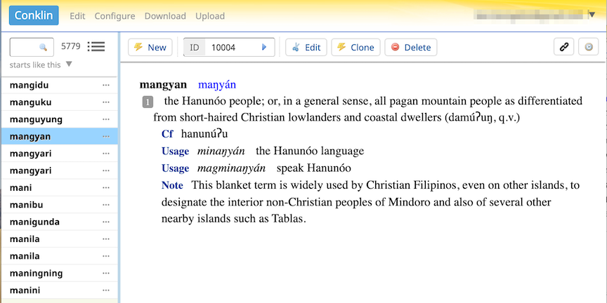

# How to Digitize a Historical Dictionary


Retro-digitization is the process of converting a paper-based historical publication into an electronic format suitable for publishing online or for sharing as a digital resource. In this tutorial, you will learn the workflow we developed to digitize a 1953 bilingual dictionary. For details, see our paper *"Using Open-Source Tools to Digitize Lexical Resources for Low-Resource Languages"* (upcoming).

We designed the workflow to enable even those with modest budgets to conduct their own retro-digitization projects. In doing so, we hope to encourage more communities, especially speakers of minority and indigenous languages, to build e-dictionaries and other digital lexical resources for their mother-tongue language.

## What You'll Do

You will use sample pages from Harold Conklin's 1953 Hanunoo-English dictionary. Hanunoo (IPA: "hanunuʔɔ") is an indigenous language spoken by ~25,000 Hanunoo Mangyan people in the Philippines. Although they have a native writing system called [Surat Mangyan](https://en.wikipedia.org/wiki/Hanunuo_script), the dictionary itself had Hanunoo words printed in Roman letters but their pronounciations were denoted with non-Roman letters. These include 5 vowels with diacritical marks (á é í ó ú), the eng character 'ŋ' and the glottal stop 'ʔ' symbol. Here are two sample entries in the dictionary:

<center></center>

<br/>

You will train the open-source Tesseract OCR engine to recognize the special character 'ŋ' since no existing engine can (the glottal stop symbol will be handled differently, and Tesseract has a language model that recognizes the vowels with diacritical marks). You will also format the OCR-ed pages into XML then load/edit/display them in a locally-installed [Lexonomy](https://www.lexonomy.eu/) dictionary server. How cool is that? :-)


_Example dictionary hosted in Lexonomy_

## Prerequisites

1. Computer running Ubuntu 18.04 or later (see Note below)
2. Python 3 installed
3. Admin privilege to install software
4. You know how to run commands in a console

To follow along, first make sure you have copied this Git project into your home folder:
```
$ cd ~
$ git clone https://github.com/isawika/retro-digitization.git
$ cd retro-digitization
```

> Note: The tutorial should run on other Linux systems with only minor tweaks, but we have not tested this. Running on Mac or Windows should also be possible but needs more work. Contact us if you want to discuss.  

## The Workflow

We follow the technical steps outlined in the [DariahTeach project](https://teach.dariah.eu/mod/page/view.php?id=343), highlighted as blue-ish boxes below:


- Step 1: Planning
- [Step 2](./Step2-ImageCapture.md): Image Capture
- [Step 3](./Step3-TextCapture.md): Text Capture
  - [3.1](./Step3.1-Proofread.md): Proofread the transcriptions
- [Step 4](./Step4-DataModeling.md): Data Modeling & Enrichment
- [Step 5](./Step5-Publish.md): Publish

