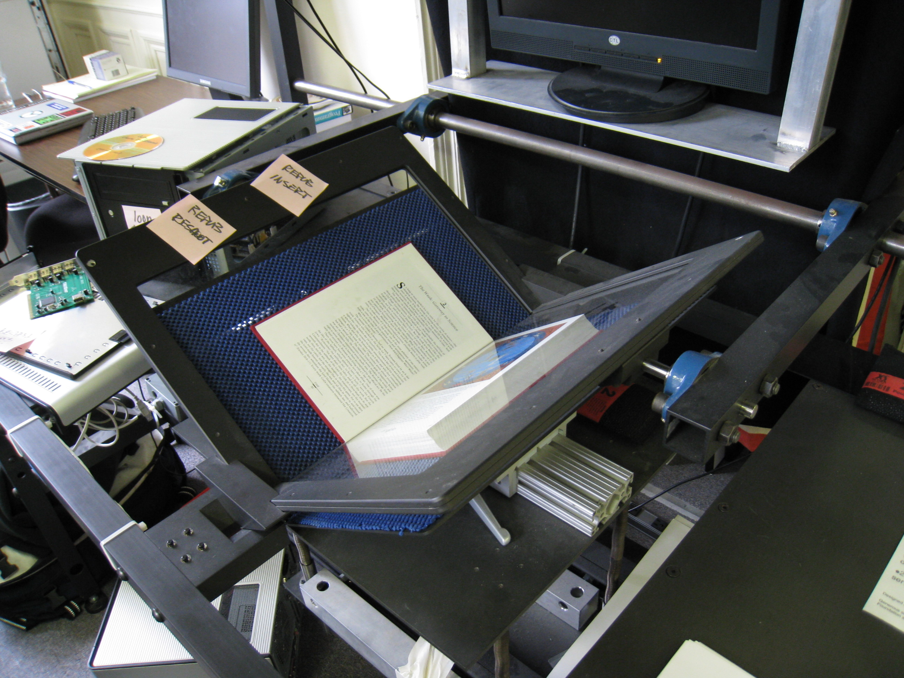

# How to Digitize a Historical Dictionary

## 1. Image Capture

Convert the dictionary into a PDF image document by scanning it. You can do this non-destructively or destructively. 

__Non-destructive Scanning__

If the dictionary is rare or valuable-- often the case for historical documents, non-destructive is your only option. Find a book scanning or document archival business who can do this for you. These firms use special hardware that holds the book with minimal stress on the spine while it automatically flips and scans the pages, a plus if you are concerned about preserving your dictionary. Below is an example of these types of specialized book scanners.

<figure>
    
    <figcaption><i>Internet Archive book scanner (Credit: <a href="https://commons.wikimedia.org/w/index.php?curid=3606255">Dvortygirl</a> - Own work, CC BY-SA 4.0)</i></figcaption>
</figure>

 

For our project, we used [Bound Book Scanning](https://boundbookscanning.com/) (New York) and were happy with the results. Before you approve the job and have your book returned, make sure to check that all pages were scanned because these machines may occasionally skip pages. This happened to us and we had to ask for the missed pages to be scanned.

Alternatively if you have the time and equipment, you can scan the book yourself.

__Destructive Scanning__

Consider destructive scanning if you can obtain the dictionary inexpensively. This involves cutting the book's spine then feeding the loose pages into a scanner. Destructive scanning may be a faster and cheaper option. Businesses such as [1DollarScan](https://1dollarscan.com/) (San Jose, California) provide this service for a reasonable fee. If you want to do it yourself, you can find plenty of instructions online such as this [WikiHow guide](https://www.wikihow.com/Unbind-a-Book).

> Note: For this tutorial, we provide a sample dictionary in PDF format so you can skip this step.

 

[Step 2](./Step2-TextCapture.md) - Text Capture