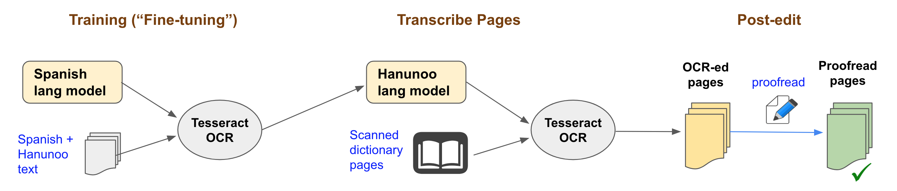

# How to Retro-Digitize a Historical Dictionary

## 3. Text Capture

In this step, you will convert the scanned dictionary pages into plain text. However there's a complication. Virtually all historical dictionaries are typeset in obsolete fonts or use special character symbols that are unknown to today's OCR software. If you use an OCR as-is, you will get lots of transcription errors that are too time-consuming and costly to correct manually. Thus it is better to first train the OCR so that it recognizes the dictionary's distinct typography before transcribing all the pages. Fortunately, OCR software such as [Tesseract](https://github.com/tesseract-ocr/tesseract) are trainable and will serve our purpose well.

Tesseract uses Deep Learning technology ([video](https://www.youtube.com/watch?v=6M5VXKLf4D4)) to recognize text from images. As of Version 4.0, it [supports](https://tesseract-ocr.github.io/tessdoc/Data-Files-in-different-versions.html) over 150 languages and scripts. In order to train it to recognize novel characters/symbols, you will train it via [fine tuning](https://tesseract-ocr.github.io/tessdoc/tess4/TrainingTesseract-4.00.html#fine-tuning-for--a-few-characters). So instead of making Tesseract learn the entire orthography of a language from scratch, you start with one of its pre-trained language models that does the best job of recognizing your target orthography, then tweak that model to learn the novel symbols. Using this approach, training Tesseract is faster and requires much less training data.

Below is a visual of what you will do.



Text Capture has 3 substeps:

- __Fine-tune__ - train the OCR to recognize the new characters/symbols in the dictionary
- __Transcribe__ - use the trained model to convert the pages into text
- __Post-edit__ - correct any residual OCR errors 

To help make these concepts clearer, we will use the Hanunoo dictionary as an example.

Let's begin!

---

<br/>

> Note: The following instructions were distilled from the Tesseract 4.0 [training guide](https://tesseract-ocr.github.io/tessdoc/tess4/TrainingTesseract-4.00.html). See that guide for mode details.

<br/>

__Prerequisite 1:__ &nbsp;_Install the needed fonts_

```
sudo apt update
sudo apt install ttf-mscorefonts-installer
sudo apt install fonts-dejavu
fc-cache -vf
```

__Prerequisite 2:__ &nbsp;_Install some required dependencies_

_PDFtk_ is a handy tool for splitting/joining/rotating PDF files while _ImageMagick_ converts PDF files into TIFF and provides lots of image processing features. Leptonica is needed to build Tesseract from source code.

```
$ sudo apt install pdftk-java
$ sudo apt install imagemagick
$ sudo apt install libleptonica-dev
```

Edit the ImageMagick policy _/etc/ImageMagick-6/policy.xml_ to allow converting PDF files. Look for a line like below and change the value of __rights__ to "read | write":

`<policy domain="coder" rights="read | write" pattern="PDF" />`

__Prerequisite 3:__ &nbsp;_Install Tesseract_

You must compile the Tesseract source code in order to use the training tools. Unfortunately, the Tesseract executables available for download do not include them.

```
$ cd retro-digitization/tutorial
```

- [Download](https://github.com/tesseract-ocr/tesseract/releases) the source code of the latest release (e.g., "v4.1.1") and unzip it
- Rename the folder (for convenience)
```
$ mv tesseract-4.1.1 tesseract
```

- Configure and build Tesseract and its training tools.
> NOTE: If the _./configure_ file does not exist or gives "undefined M4 macro" errors when you run it, run "_autoreconf --install_" first and then run "_./configure_" again.

```
$ cd tesseract
$ ./configure
$ make
$ make training
```

- Using your favorite text editor, open the file _src/training/language-specific.sh_. Look for the line that starts with "__LATIN_FONTS=__". Comment out the following lines and re-save the file.

    "URW Bookman L Bold" \
    "URW Bookman L Italic" \
    "URW Bookman L Bold Italic" \
    "Century Schoolbook L Bold" \
    "Century Schoolbook L Italic" \
    "Century Schoolbook L Bold Italic" \
    "Century Schoolbook L Medium" \

__Optional:__ &nbsp;Install Tesseract and the training tools so you run them without giving the full path. They will be installed in _/usr/local/bin_

```
$ sudo make install training-install
```

---

<br/>

[Step 3.1](./Step3.1-PrepareTraining.md) - Prepare the Training Data