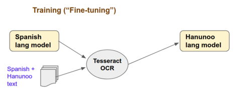
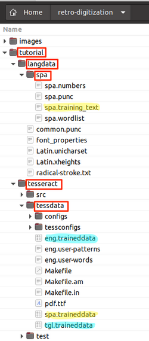

# How to Retro-Digitize a Historical Dictionary

### 3.2 Run the Tesseract Fine-tuning 

Recall the concept behind fine-tuning. We use a pre-existing language model (_Spanish_) along with training data (_Spanish and Hanunoo text_) to train Tesseract and produce a new language model (_Hanunoo_) that can accurately transcribe the Hanunoo dictionary.



Let's see how this works in practice.

After you complete this substep, your _tutorial_ folder should look like below (for brevity, the screenshot doesn't include all folders/files):

 - _langdata_ - describes properties Latin and Spanish characters. The _spa.training_text_ file contains the original Spanish training text. You will modify this file later by adding Hanunoo text.
 - _tesseract/tessdata_ - contains the pre-trained Spanish language model (as well as other pre-trained models)



#### 3.2.1 Create the _langdata_ folder

- Run the following commands by pasting them to a terminal console.

```
cd retro-digitization/tutorial

mkdir langdata
cd langdata
wget https://raw.githubusercontent.com/tesseract-ocr/langdata_lstm/master/radical-stroke.txt
wget https://raw.githubusercontent.com/tesseract-ocr/langdata_lstm/master/common.punc
wget https://raw.githubusercontent.com/tesseract-ocr/langdata_lstm/master/font_properties
wget https://raw.githubusercontent.com/tesseract-ocr/langdata_lstm/master/Latin.unicharset
wget https://raw.githubusercontent.com/tesseract-ocr/langdata_lstm/master/Latin.xheights

mkdir spa
cd spa
wget https://raw.githubusercontent.com/tesseract-ocr/langdata/master/spa/spa.training_text
wget https://raw.githubusercontent.com/tesseract-ocr/langdata/master/spa/spa.punc
wget https://raw.githubusercontent.com/tesseract-ocr/langdata/master/spa/spa.numbers
wget https://raw.githubusercontent.com/tesseract-ocr/langdata/master/spa/spa.wordlist
```

- Using your favorite text editor, open the original Spanish training text (_tutorial/langdata/spa/spa.training_text_) and append the 40 lines of Hanunoo text (_tutorial/hanunoo.txt_). Make sure to save the modified file as plain text.

#### 3.2.2 Create the working folders

These folders will store the model training and evaluation results.

```
tesseract/src/training/tesstrain.sh --fonts_dir /usr/share/fonts --lang spa --linedata_only \
--noextract_font_properties --langdata_dir ./langdata \
--tessdata_dir ./tesseract/tessdata --output_dir $(realpath .)/train

tesseract/src/training/tesstrain.sh --fonts_dir /usr/share/fonts --lang spa --linedata_only --noextract_font_properties --langdata_dir ./langdata --tessdata_dir ./tesseract/tessdata --fontlist "Impact Condensed" --output_dir $(realpath .)/eval
```

#### 3.2.3 Train Tesseract

This is where you actually run the Tesseract training session. Depending on your computer, this may take some time (20 mins or more) so be patient.

```
cd retro-digitization/tutorial/tesseract

combine_tessdata -e tessdata/spa.traineddata \
  ../train/spa.lstm

lstmtraining --model_output ../train/Output \
  --continue_from ../train/spa.lstm \
  --traineddata ../train/spa/spa.traineddata \
  --old_traineddata tessdata/spa.traineddata \
  --train_listfile ../train/spa.training_files.txt \
  --max_iterations 3600
```

While the training is running, you will see messages indicating the progress.

>At iteration 1068/3500/3500, Mean rms=0.197%, delta=0.069%, char train=0.357%, word train=0.944%, skip ratio=0%,  New worst char error = 0.357 wrote checkpoint.
>
>At iteration 1082/3600/3600, Mean rms=0.195%, delta=0.069%, char train=0.368%, word train=0.981%, skip ratio=0%,  New worst char error = 0.368 wrote checkpoint.
>
> Finished! Error rate = 0.35

#### 3.2.4 Check the Results

Run the following command to see the accuracy on the training data.
```
lstmeval --model ../train/Output_checkpoint \
  --traineddata ../train/spa/spa.traineddata \
  --eval_listfile ../train/spa.training_files.txt
```

> __Result (in %):__ &nbsp;&nbsp;Eval Char error rate=0.32697486, Word error rate=0.82170503

These are great results; they mean 99.7% char-level and 99.2% word-level accuracy.

To check how robust the model is, let's see how well it does on text that is rendered in a new (unseen) font called ‘Impact’. Run the following command:

```
lstmeval --model ../train/Output_checkpoint \
  --traineddata ../train/spa/spa.traineddata \
  --eval_listfile ../eval/spa.training_files.txt
```

> __Result:__ &nbsp;&nbsp;Eval Char error rate=5.1881268, Word error rate=15.057201

The model performed less accurately (95% char-level and 85% word-level), but this is expected.

#### 3.2.5 Create the Hanunoo Language Model

Run the command below. It will create the Hanunoo language model as _tutorial/final/hnn.traineddata_

```
mkdir ../final
lstmtraining --stop_training \
  --continue_from ../train/Output_checkpoint \
  --traineddata ../train/spa/spa.traineddata \
  --model_output ../final/hnn.traineddata
```

<br/>

[Step 3.3](./Step3.3-Transcribe.md) - Transcribe