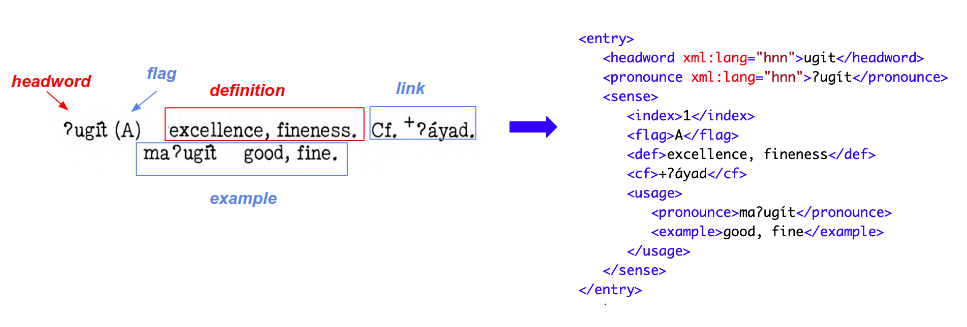
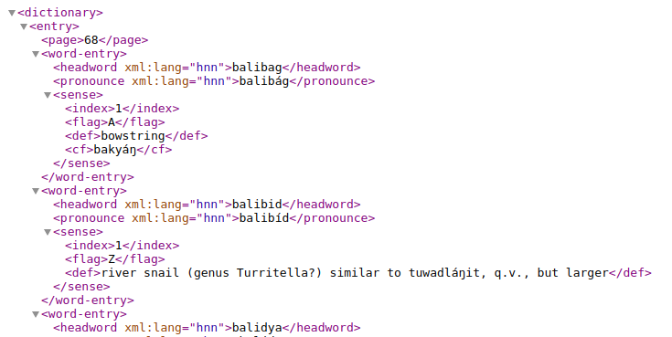

# How to Retro-Digitize a Historical Dictionary

## Step 4: Convert to XML

After proofreading the pages, you will now convert them into XML documents.

### 4.1 Design the XML Schema

To design the XML schema, you'll need to address these questions:
  - what elements are needed?
  - how should the elements be named?
  - how should they be organized?

We took the pragmatic approach of letting the structure of the print dictionary inform the design of the XML schema. However we decided to encode the entries without preserving the original print layout. That is, we removed page numbers as well as hyphens that split words at the end of the line.

In naming the XML elements and organizing them, we followed (at least in spirit) the [TEI-0 Encoding Standard](https://dariah-eric.github.io/lexicalresources/pages/TEILex0/TEILex0.html#) but took liberties in simplifying our schema. Here is an example of a dictionary entry and its corresponding XML representation.



Note the several data enhancements:

- a _\<headword\>_ element is inserted with all the special symbols (glottal stop, diacritical marks) removed. This element allows for easier sorting and searching of the entries.
- the "example" component is encoded as two XML elements
- a sense index is inserted

The converter tool performs other enhancements that are not shown in this example.

### 4.2 Parse the pages into XML

You will need to write a program to do the actual text-to-XML conversion. 

> Note: &nbsp;If you skipped the __Fine-Tuning__ section of this tutorial, you can still see how the converter works by running it against one the Exammple proofread pages we provided, as shown below.

```
$ python3 ../conklin2xml.py Examples/sample-02.txt > sample-02.xml
```



### 4.3 Make the remaining enhancements manually

<br/>

[Step 5](./Step5-Publish.md) - Publish