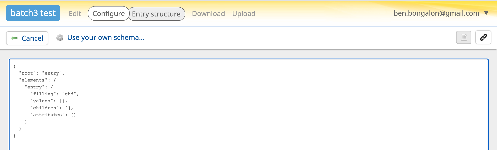
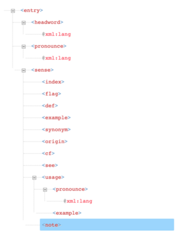

# How to Retro-Digitize a Historical Dictionary

### Step 5: Publish

Finally, you can publish your e-dictionary! To do this, you will load the edited XML entries into Lexonomy and configure the page layout to customize the look-and-feel.

#### 5.1 Create an empty dictionary
- Home -> Create a dictionary -> (no template)

#### 5.2 Specify the XML schema
- From the menu, click Configure -> Structure
- Select the  icon to switch to raw Json mode. You should see something like this:

- Replace the text with the content of this [_conklin-schema.json_](./tutorial/conklin-schema.json) file.
- Click the icon again to switch back to graphical mode.
- Press 'Save'.

The new schema should look like below when viewed in XML (non-raw) mode.

#### 5.3 Customize the layout
- From the menu, cick Configure -> Formatting -> Use your own stylesheet
	- Copy the content of [_conklin-formatting.xslt_](./tutorial/conklin-formatting.xslt) into the XSL textbox
	- Copy the content of [_conklin-formatting.css_](./tutorial/conklin-formatting.xslt) into the CSS textbox
	- Press 'Save'

#### 5.4 Load the XML entries

For each of the XML dictionary files, select:
- From the menu, click Upload -> Choose File (then pick the file)
- Click the 'Upload' button

If all goes well, you should now be able to see the e-dictionary displayed with the custom style like below:

<h3>Congratulations!</h3>
